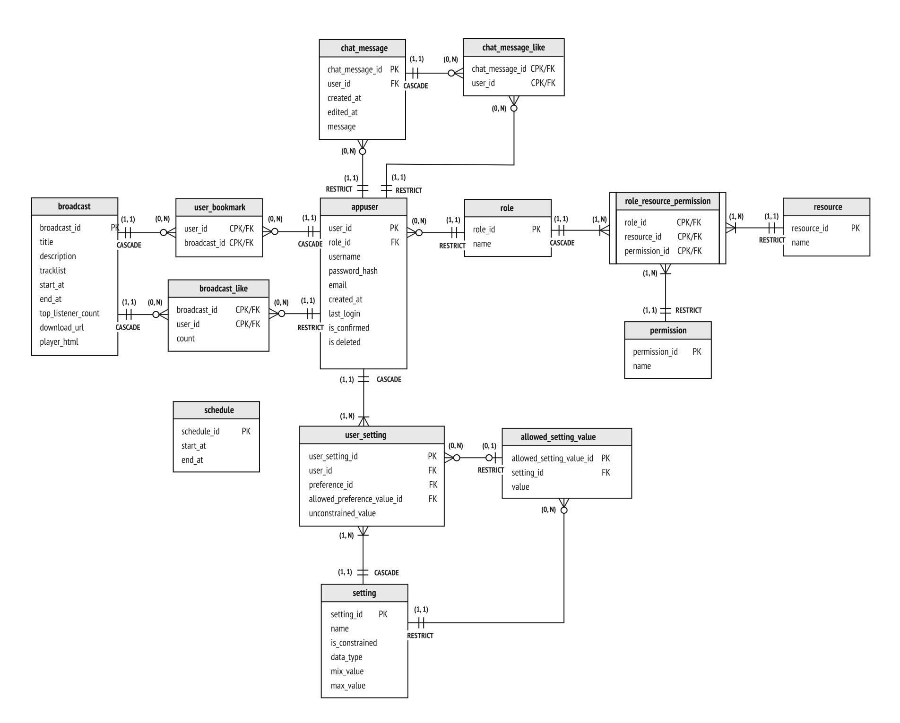
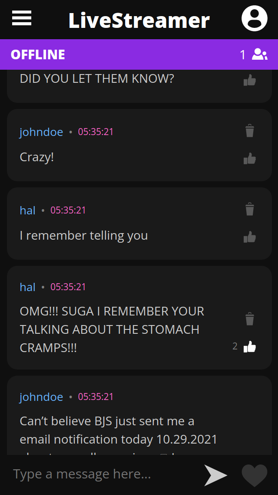
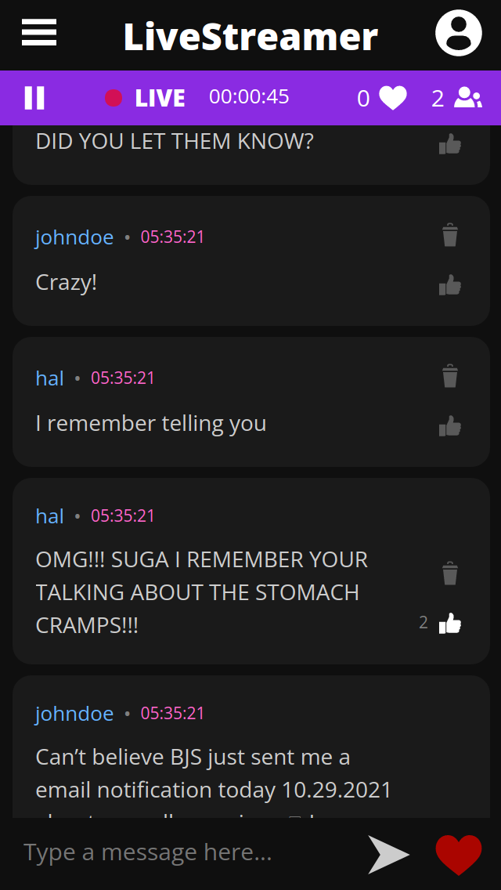
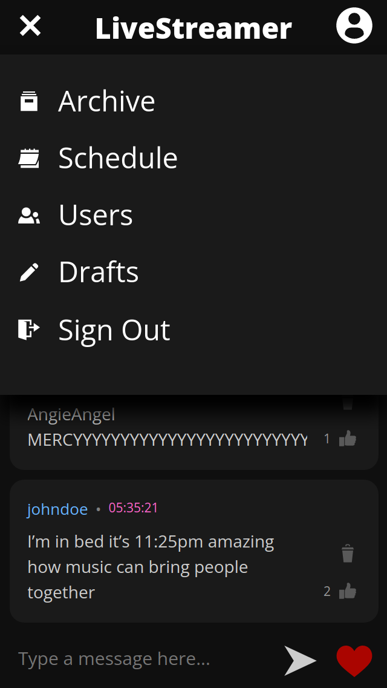
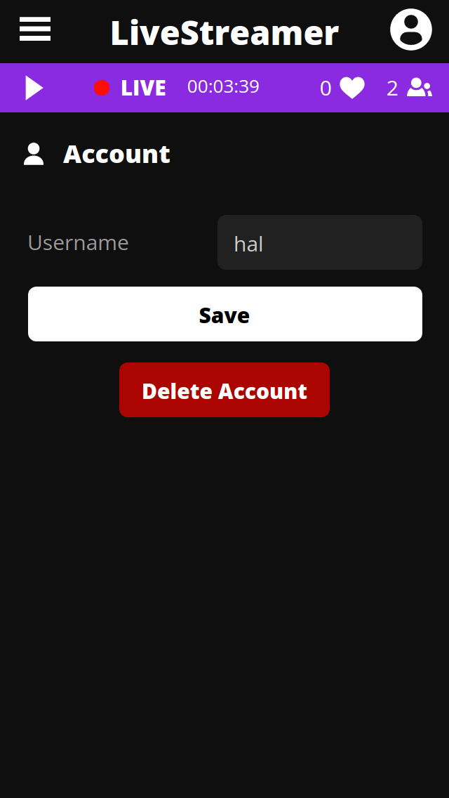
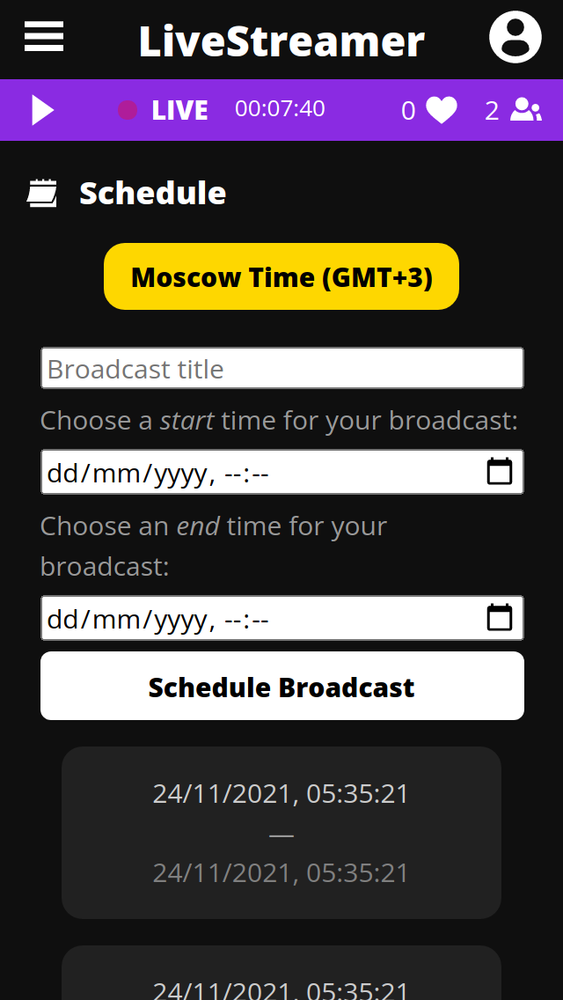
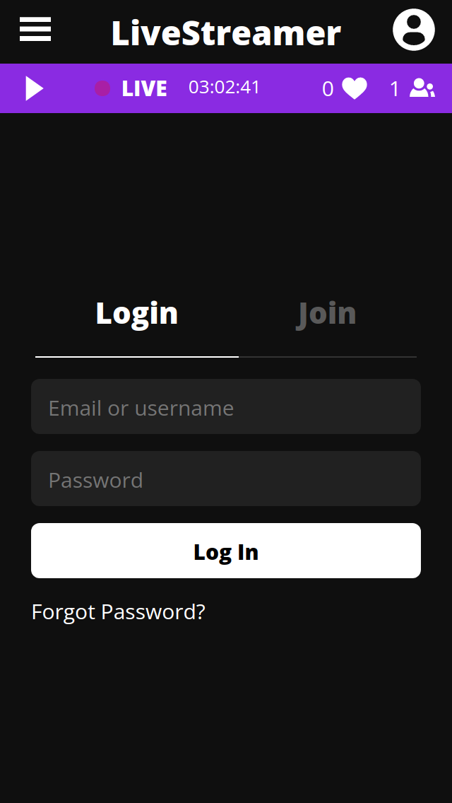
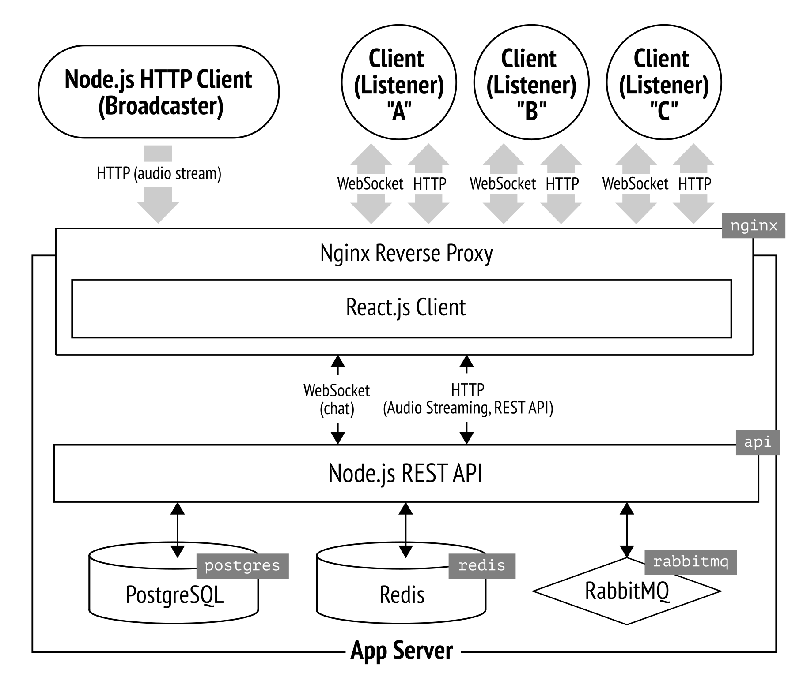

# LiveStreamer

## About

Многопользовательское веб-приложение для аудио-стриминга и общения в чате. Концептуально, это клон <a href="http://mixlr.com">Mixlr</a>, но в меньшем масштабе. Архитектурно, состоит из трёх компонентов: фронт, API и CLI-приложение для стриминга. Аудио-стриминг реализован по HTTP, а чат, интерактивные функции и уведомления — через WebSocket. Желающий постримить, запускает на своей машине HTTP клиент, который захватывает музыку из ОС и отправляет её на сервер приложения, с которого уже каждый слушатель, открывший приложение, может слушать стрим, общаться в чате, ставить лайки и пользоваться другими интерактивными функциями. Более подробное описание см. на ГитХабе.

---

Web application for broadcasting live audio and chatting. Conceptually, it is similar to [Mixlr](http://mixlr.com) but on a smaller scale.

Suppose you're a dj and you want to broadcast your mix live. All you need to do is to start up [this command-line app](https://github.com/ponomarevandrey/live-streamer-source-client) on your local machine — it captures the live audio output and streams it to the application server, which in turn broadcasts the audio to all connected listeners.


### Stack

* **backend:** TypeScript, Node.js (Express.js), PostgreSQL (raw SQL, without ORM), Redis
* **frontend:** React.js, SASS
* **CI/CD:** GitHub Actions, Docker Compose and lots of Bash scripts


## Backend

### App server (`/api` dir)

Here's a quick overview of features implemented in application server's API:

* cookie session authentication
* registration confirmation (by email)
* forgotten password recovery (by email)
* soft account deletion
* RBAC authorization
* caching of SQL queries (using Redis)
* rate-limiting
* cursor pagination
* chat (over HTTP + WebSocket)


### Database (`/postgres` dir)




### Secondary database / cache (`/redis` dir)

Redis is used for:

* caching API requests
* storing frequently updated real-time data e.g. stream likes, stream metadata, authenticated user sessions.


### HTTP Server (`/nginx` dir)

Nginx is used as reverse proxy in front of the App server.

Besides its main purpose — to proxy HTTP and WebSocket traffic — it is also configured as a rate limiter.


### Frontend (`/frontend` dir)

Some screenshots (just to give you an idea of how the app looks in different states):














## Streaming client (`/streaming-client` dir)

The client app consists of two parts: 
* child process capturing all OS audio
* HTTP client, sending the captured audio to the server in real-time. 

To authenticate to the application server, the client uses regular cookie authentication.


### Requirements

This command-line app requires two environment variables containing your username and password: `BROADCASTER_USERNAME` and `BROADCASTER_PASSWORD`.


### How to use

1. First, log in to the application server: `node build/index.js login:prod`
2. Now you can start broadcasting audio. Issue the following command:
   ```shell
   node build/index.js stream:prod
   
   # You can pass additional 'save' option to write the stream to disk while you're streaming:
   node build/index.js stream:prod save
   ```
3. After the stream is finished, log out: `node build/index.js logout:prod`

   If you have passed the `save` option in step 2, you will find the `.wav` file of the recorded stream in the `recordings` directory.


## App Architecture

The app is comprised of the two main parts:

* `livestreamer-backend/` — **Docker Compose project for the application backend.**
  * `api/` service — Node.js REST API
  * `postgres/` service — application main database, PostgreSQL
  * `redis/` service — used as cache and storage for the real-time data
  * `nginx` — this directory is NOT a part of Docker Compose project, Nginx is deployed manually by copying config files from this directory to server.
  
* `livestreamer-frontend/`. **Docker Compose project for the application frontend.**
  * `client/` service — React.js app. Run this container only in development environment.

There are 3 environments set up in Compose:

* production
* development
* test (not configured yet)

---

```
                                                        chat over WebSocket + HTTP
            auido stream over HTTPS/1.1           audio stream over HTTP WebSocket
 BROADCASTER -----------------------> || APP SERVER ---------------------------> LISTENERS
(HTTP client)       mp3, 128kbps      ||                   mp3, 128kbps        (React Client)
                                      ||
                              Nginx as reverse proxy
                          translating HTTPS/1.1 to HTTP/2
```




## How the app works 

### High-level overview

The app involves three parties: **source client (aka broadcaster)**, **Application Server** and **consuming client (aka listener(s))**:

* **source HTTP client (aka broadcaster)** (the app and its documentation are in the [separate repo](https://github.com/ponomarevandrey/live-streamer-source-client)) — it captures the audio output from OS and streams it to the app server using regular progressive HTTP streaming
* **application server** (this repo) — serves as audio streaming and chat server. It provides REST API used by both Source Client app and React.js client app. App server takes the incoming audio stream and passes it through to listeners.
* **consuming clients (aka listeners)**. React.js client-side app.


### Low-level overview

The application server is implemented as REST API and provides two main features of the app: audio broadcasting and chat.

0. To start streaming, the broadcaster should start the command line [Source Client app](https://github.com/ponomarevandrey/live-streamer-source-client) and log in to the application server. Authentication is implemented using a cookie session (stored in Redis).
1. When the broadcaster starts streaming, the Source Client app sends chunked audio stream in PUT request to `/stream` endpoint. Application server stores all live stream data (listener count, likes, etc.) in Redis.
2. Application server detects the start of the stream and sends a notification to the frontend over WebSocket.
3. On the client side, React receives WebSocket notification and switches into "LIVE" mode, displaying the stream status, timer, number of listeners online, and other data. When the user clicks the 'play' button, React fetches live audio using `GET /stream`.
4. During the stream, listeners can "like" the broadcast showing that they like the music by clicking the 'heart' button. After clicking, the button becomes inactive for 10 seconds. The API endpoint allowing to "like" the broadcast is rate limited, so if the client attempts to trick the app by sending multiple "like" requests directly to the API endpoint, Nginx will ban the client's IP for some time.
5. After the broadcast is finished, all stream data is saved from Redis to PostgreSQL. By default, the finished stream is hidden — it is not visible to listeners; only the user with broadcaster's permissions can log in and publish (make visible to everyone) the finished broadcasts. Broadcaster can also edit/update title, description, links, and other metadata of past broadcasts.
6. Broadcaster can schedule new broadcasts (this feature is currently supported only by API; React client doesn't provide an interface for this). To do this, the client should send the scheduled broadcast's title and start/end date, and time

All chat functionality, notifications as well as other real-time features are implemented over WebSocket + HTTP. Technically it is possible to implement everything solely over WebSocket, but it would end up in a pretty chaotic and unreliable client-server communication. So, to make the interaction more organized, I utilize both WebSocket and HTTP. For instance, this is how I implemented the chat:

1.  Client sends a chat message to REST API
2.  API saves the message to the database and returns 200 response to the sender.
3.  Then API broadcasts the saved message to all connected clients (except sender) over WebSocket.

    Thus we get the benefits of REST architecture and Websocket protocol at the same time. While WebSocket allows us to do everything in real-time, REST provides the structure and order in client-server communication.


## Deployment

### Frontend 

To build and deploy the app to production env., run `build-and-deploy.sh` script located in `livestreamer-frontend` directory. 

It will start Compose with `client` container with all production environment variables, compile the code, stop the container and upload the compiled code to the server (`/var/www/...`) where the app will be served by Nginx. 


### Backend

To build and deploy the app to production env., manually rebuild local image(s) > upload them to Docker Hub > on VPS pull images from Docker Hub and restart all or only the required containers. 

Here is a short explanation of how to do this:

> Steps 1 and 3 are required only when you deploy the app to the server for the very first time. 
>
> After that, when you're just updating the code, skip those steps.

1. **Uncomment these lines *for each service* in `docker-compose.prod.yml`**
   ```yml
   build:
     context: ...
     dockerfile: ...
   ```
2. **Build production images of all or only the required services**
   ```shell
   cd livestreamer-backend
   docker-compose -f docker-compose.yml -f docker-compose.prod.yml build
   
   # OR build image for only one service:
   docker-compose -f docker-compose.yml -f docker-compose.prod.yml build api
   ```
3. **Comment out the lines we've uncommented at step 1 again**; otherwise when you'll have this files copied to your server and passed to `docker-compose up -f ...`, Compose will build images localy using Dockerfiles instead of pulling the images from Docker Hub. This eventually won't allow us to set up CI/CD with GitHub Actions.

4. **Authenticate to Docker Hub**
   ```shell
   docker login
   ```
5. **Push all or only the required images to Docker Hub**
   ```shell
   docker push ponomarevandrey/livestreamer-backend_api
   docker push ponomarevandrey/livestreamer-backend_redis
   docker push ponomarevandrey/livestreamer-backend_db
   ```
6. **SSH into VPS**

7. **Pull new image**
   ```shell
   # 'api' is the container name
   docker-compose -f docker-compose.yml -f docker-compose.prod.yml pull api
   ```
8. **Restart the container**. If you need to restart only the containers whose image was updated (as we usually do) add the `--no-deps` flag. 
   ```shell
   docker-compose \
     -f docker-compose.yml \
     -f docker-compose.prod.yml \
     up
       --force-recreate \
       --build 
       # + optional `--no-deps` and `-d`
   ```
   * Without `--force-recreate` Compose will use the old image
   * Without `-d` flag Compose will run in "attached mode" outputing everything to console. 
     > By default, Docker runs the container in attached mode. In the attached mode, Docker can start the process in the container and attach the console to the process’s standard input, standard output, and standard error ([source](https://www.java4coding.com/contents/docker/docker-attached-vs-detached-mode))
      
     So later when we will be automating the deployment with GitHub Actions, always use `-d` everywhere to detach the terminal from Compose process stdout/stderr. When we write any deployment Bash scripts we should use the '-d' flag as well.

9. **Delete old image** to free up the disk space
   ```shell 
   docker image prune -f
   ```

   * If you're deploying the app for the first time — refer to [my article on setting up CI/CD with GitHub Actions](https://andreyponomarev.ru/articles/2021-02-12-ci-cd-for-vps-with-github-actions.html), "Manual Deployment" section, from bullet point four and on.
   * If you want just to update the specific container — refer to [my article on setting up CI/CD with GitHub Actions](https://andreyponomarev.ru/articles/2021-02-12-ci-cd-for-vps-with-github-actions.html), "Redeployment" section.


## Current Development Status

* all of the essential features of the app server are implemented; the code needs some refactoring, but I decided not to touch anything until I write more unit tests
* at the moment of writing, React client uses only a fraction of the existing API


